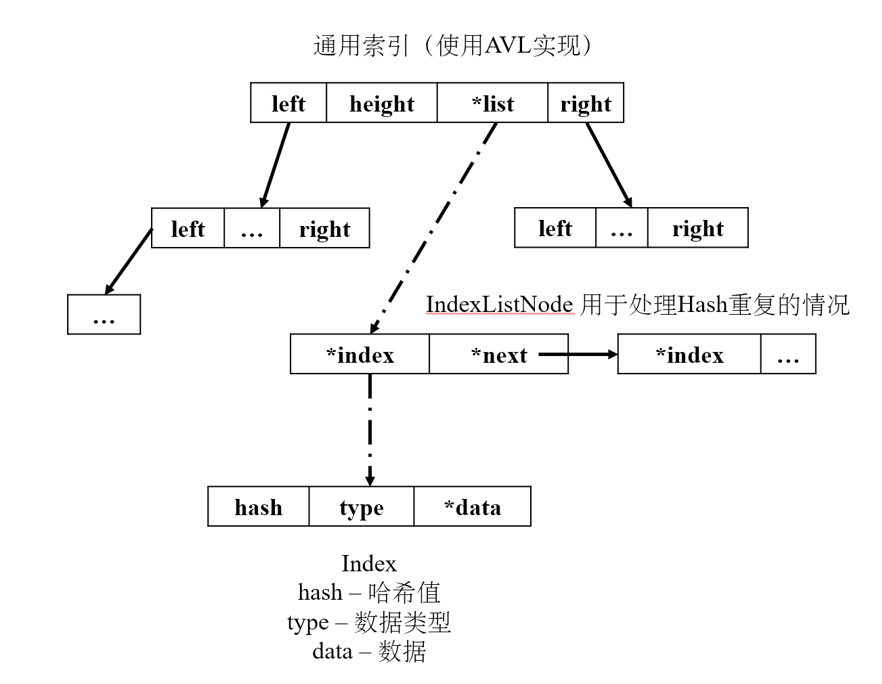

# USST-Datastruct_CourseSystem

`上海理工大学数据结构课程设计：课程信息管理系统`的设计实现。

## 项目要求

为某学校计算机专业开发一个课程信息管理软件，该软件有三类 用户：管理员、教师和学生，其分别具有如下功能

管理员：

1. 创建计算机专业课程信息
2. 添加计算机专业课程信息
3. 删除计算机专业课程信息
4. 统计计算机专业开设课程的总数
5. 查询每门课程修课人数
6. 浏览计算机专业的课程信息

教师：

1. 查询自己带的课程信息
2. 查询自己带的班级学生信息
3. 输入课程成绩
4. 修改课程成绩
5. 统计课程 90 分以上的人数、80\~90 分的人数、60\~80 分的人数、60 分以下的人数

学生：

1. 查询课程信息
2. 报名课程学习
3. 取消课程学习
4. 查询课程成绩
5. 浏览所有课程信息

其中，课程信息至少包含：课程号、课程名、课程的学分、任课教师、上课时间、上课地点、考试成绩；

学生信息至少包含：学号、姓名、联系方式。

## 项目设计

### 数据结构

通过分析系统功能，我们确定涉及到的操作对象主要有三类：用户（User）、课程（Course）和学生选课（CourseSelection）。

对于用户（User）实体，我们选择使用顺序结构来组织各个属性字段，并进一步采用有序集合来存储多个用户实体的数据。具体的逻辑结构形式如图1-2-1所示：


在课程（Course）实体方面，我们也采用顺序数据结构以组织各个属性字段。值得注意的是，其中的“开课教师”属性字段专门用于存储对应的教师用户实体。与用户实体类似，我们也采用有序集合数据结构来汇聚和存储多个课程实体。该逻辑结构的具体形式如图1-2-2所展示。


在学生选课（CourseSelection）实体的设计方面，我们沿用与课程（Course）实体类似的数据存储结构。在“选课学生”和“选课课程”属性字段中，我们分别存储对应的学生和课程实体。该逻辑结构的具体形式如图1-2-3所示。


这种设计方案便于实施各种查询和修改操作，同时也为将来可能的功能扩展提供了灵活性。

为了实现多样的查询功能，包括基于教师身份查询所教授课程，以及基于学生身份查询已选课程等，同时优化代码的可重用性与可维护性，我们采取了一种策略，即将用于查询的数据结构（称为通用索引，Index）与各个实体类型（User、Course、CourseSelection）进行解耦。在这里，我们以实体的id作为主键，其他必要信息作为次要键，并通过通用索引创建多级索引。索引同样采用顺序结构组织各个属性字段，并使用有序集合存储多个索引的实体数据。具体的逻辑结构形式如图1-2-4所示。


在前述通用索引结构的基础上，我们设计了一系列专门的索引，以满足系统不同方面的需求。具体的索引结构、功能以及所存储的键（Key）和值（Value）的类型如表1-2-1所示。

| 索引名称                            | 键（Key）                         | 链表内值（Value）       | 功能描述                            |
|---------------------------------|--------------------------------|-------------------|---------------------------------|
| user_id_Index                   | 用户ID                           | 对应的用户结构体          | 便于通过用户ID快速检索用户信息，同时缓存从文件加载的数据   |
| user_name_Index                 | 用户姓名的哈希值                       | 用户ID              | 通过用户姓名的哈希值检索其ID                 |
| user_empId_Index                | 用户学工号的哈希值                      | 用户ID              | 通过学工号的哈希值检索用户ID                 |
| user_file_Index                 | 用户ID                           | 存于系统文件中的用户数据文件名   | 映射用户ID与其在文件系统中的数据文件             |
| course_id_Index                 | 课程ID                           | 对应的课程结构体          | 便于通过课程ID快速检索课程信息，同时缓存从文件加载的数据   |
| course_name_Index               | 课程名称的哈希值                       | 课程ID              | 通过课程名称的哈希值检索其ID                 |
| course_teacherId_Index          | 教师ID                           | 教师所教授的课程ID        | 便于查找教师负责的所有课程                   |
| course_file_Index               | 课程ID                           | 存于文件系统中的课程数据文件名   | 映射课程ID与其在文件系统中的数据文件             |
| selection_id_Index              | 选课信息ID                         | 对应选课信息结构体         | 便于通过选课信息ID快速检索选课信息，同时缓存从文件加载的数据 |
| selection_userId_Index          | 用户ID                           | 用户所选课程ID          | 检索某个用户选择的所有课程                   |
| selection_courseId_Index        | 课程ID                           | 课程对应选课用户ID        | 查找选修某一课程的所有用户                   |
| selection_userId_courseId_Index | 用户ID与课程ID组合后计算的哈希值             | 选课信息ID            | 通过用户ID和课程ID组合进行复合检索             |
| selection_file_Index            | 选课信息ID                         | 存于文件系统中的选课信息数据文件名 | 映射选课信息ID与其在文件系统中的数据文件           |
| global_counter_Index            | 对应不同数据，例如user、course、selection | 统计每个类型的数据包含多少条数据  | 用于全局计数，如统计不同实体类型的数据条数等          |

在存储操作对象时，目标是对各操作对象信息的各字段进行快速而准确的查询与修改。为实现该目标，我们选择使用结构体（Struct）的方式来对各实体进行存储。
用户（User）、课程（Course）与选课信息（CourseSelection）的结构体如下方代码所示：

```c
// 用户
typedef struct {
    int64 id;              // 用户ID
    char name[21],         // 用户姓名
    passwd[65],            // 密码
    empId[21];             // 学工号
    int role;              // 用户角色 0-学生 1-教师 2-管理员
    char contact[201];     // 联系方式
    int64 lastLoginTime;   // 最后一次登录时间戳
} User;

// 课程
typedef struct {
    int64 id;            // 课程ID/课程号
    char courseName[101],// 课程名称
    description[501];    // 课程描述
    int64 teacherId;     // 任课老师ID
    User *teacher;       // 任课老师
    int type,            // 课程类型：0-必修 1-选修 2-公选 3-辅修
    weekStart,           // 开课周
    weekEnd,             // 结课周
    currentMembers,      // 当前报名人数
    maxMembers;          // 最大可报名人数
    char location[101];  // 上课地点
    double points;       // 学分
    int schedule[7][13]; // 每星期课程安排
} Course;

// 选课信息
typedef struct {
    int64 id;                // 选课ID
    int64 studentId;         // 学生ID
    User *student;           // 学生信息
    int64 courseId;          // 课程ID
    Course *course;          // 课程信息
    int64 selectionTime;     // 选择该课程的时间
    int64 score;             // 成绩
} CourseSelection;

```

考虑到对内存空间的高效利用，我们选择采用链式存储结构来存储多个操作对象。链式存储结构在存储密度和存储灵活性方面展示出优越性，允许我们在不需连续内存空间的条件下，实现动态数据存储。

具体而言，用户（User）、课程（Course）和学生选课信息（CourseSelection）实体将被集成至2.1.1.2节所述的基于平衡二叉树（AVL Tree）实现的通用索引中，即user_id_Index、course_id_Index和selection_id_Index。

为了确保数据的持久性和一致性，我们采用了一种结构化的文件存储策略。具体地，不同类型的数据结构体将被分别存储在独立的文件夹内，以便于数据的加载和管理。以下是各种数据存储方式的详细描述：

**课程数据文件（Course）** 这类文件将被存储在data/course文件夹中，并使用.dat作为文件扩展名。目前，文件的命名约定是使用课程ID，这一规范可以根据后续需求进行调整。

**用户数据文件（User）与选课数据文件（CourseSelection）** 用户和选课的数据存储策略与课程数据高度相似，包括文件夹的布局和文件的命名规则，因此在这里不做重复说明。

通用索引采用平衡二叉树（AVL树）与链表的组合方式进行构建。由于平衡二叉树具有高效的结构特性，其可将单次查询操作的时间复杂度降至O(logN)。在二叉树中，节点的Key由特定哈希函数计算生成，其数据类型为int64；相应的Value则是链表节点（IndexListNode），链表中的数据区指向一个特定的Index数据结构。这个Index数据结构包含哈希值和相应的实体数据结构的指针。
上述通用索引的存储结构见图1-2-5。



通用索引涉及的相关代码定义如下：

```c
// 索引类型
typedef enum {
    INDEX_TYPE_INT64,       // 整数
    INDEX_TYPE_STRING,      // 字符串
    INDEX_TYPE_OBJECT       // 对象
} IndexType;

// 索引
typedef struct {
    int64 hash;             // 哈希值
    IndexType type;         // 索引类型
    void *data;             // 数据
} Index;

// 索引链表
typedef struct IndexListNode {
    Index index; // 索引
    struct IndexListNode *next; // 下一个节点
} IndexListNode;

// AVL树节点
typedef struct AVLNode {
    IndexListNode *list;    // 索引链表
    int height;             // 节点高度
    struct AVLNode *left;   // 左子树
    struct AVLNode *right;  // 右子树
} AVLNode;
```

在实现数据持久性与一致性的过程中，通用索引（Index）类型的实体将通过文件的形式被存储在data/index文件夹中，并采用.avl的文件扩展名。文件的命名规范是与相应的索引名称一致。

为了优化数据的加载和访问性能，我们采用了一种混合的数据加载策略，结合预加载和懒加载的特点。具体来说，系统在启动阶段会预先加载所有的索引数据，而实体数据（如课程、用户及选课数据）则采用懒加载的机制。以下是该策略的详细说明：

**预加载索引** 在系统启动时，所有的索引文件将被预先加载到内存中。这种预加载策略有助于减少在后续操作中的索引查询时间，从而提高系统的响应速度。

**实体数据的懒加载** 对于课程、用户和选课的实体数据，系统采用懒加载策略。具体而言，当某一函数调用需要访问这些实体数据时，系统会首先通过相应的file_Index索引查找数据所对应的文件名。随后，该文件会被加载到内存并存储在对应的id_Index中。

**数据缓存** 一旦实体数据被加载到内存中，它将被缓存以供后续的请求使用。这意味着在下一次相同的数据请求发生时，系统会直接从内存中返回这些缓存数据，从而避免了不必要的文件I/O操作。

通过这一混合数据加载策略，我们不仅降低了系统启动时的I/O负担，还提高了数据访问的效率和响应速度。这种机制进一步加强了系统的可扩展性和可维护性，同时也优化了资源的使用和管理。

## 功能设计

以下是主程序的功能设计伪码，包括从系统初始化到执行相应功能的整体流程：

```text
Function 主函数(){
	配置显示设置(); // 切换控制台编码模式、设置标题等
	加载中文转哈希函数的必要配置();
	加载索引(); // 从文件中加载必需的索引
	Label Login: // 标记登录标签，用于后续跳转
	登录系统(); // 执行登录相关操作
	// 登陆成功后
	打印主菜单(); // 打印主菜单
}

Function 登录系统() {
	String username = 从控制台获取用户名();
	String password = 从控制台获取密码();
	// 判断用户名或密码的格式是否正确
	If (!Regex.match(USERNAME_PATTERN, username) or !Regex.match(PASSWORD_PATTERN, password)) {
		显示错误信息(“用户名或密码不正确”);
		continue;
	}
    String hashedPassword = hmac_sha256(password, SECRET); // 计算密码的hmac_sha256值
	User *user = DB_getUserByEmpId(username); // 获取用户
	if (!user || user.passwd != hashedPassword) {
        显示错误信息(“用户名或密码错误”);
        goto Login;
    }
    currentUser = user; // 设置登录状态
	显示登陆成功信息();
}

Function 打印主菜单(){
	Label Refresh;
	初始化屏幕设置(); // 清屏、设置窗口大小等
	Switch (currentUser.role){ // 根据不同角色显示不同菜单
		Case 学生:
			显示学生菜单();
			Break;
		Case 教师:
			显示教师菜单();
			Break;
		Case 管理员:
			显示管理员菜单();
			Break;
		Default:
			显示报错信息(“未知用户角色”);
			Goto Login;
    }
    Int choice = 从控制台读取选项();
    // 由于选项最多不超过10个
    If (choice not in [1..10])｛
        显示报错信息(“无效选项”);
        Goto Refresh;
    ｝
    // 由于角色只有0、1、2，所以可以用这一特性区分不同角色的不同功能
    Int parsedChoice = currentUser.role * 10 + choice;
    执行相应操作(parsedChoice);
    Goto Refresh; // 执行完毕后，还需继续读取下一个操作
}

Function 执行相应操作(parsedChoice){
	Switch (parsedChoice){
		Case a:
		Case b:
			某公共功能();
			Break;
		Case aa:
			某角色独有功能();
			Break;
		// …
		Default:
			显示错误信息(“无效选项”);
			Break;
    }
}

```